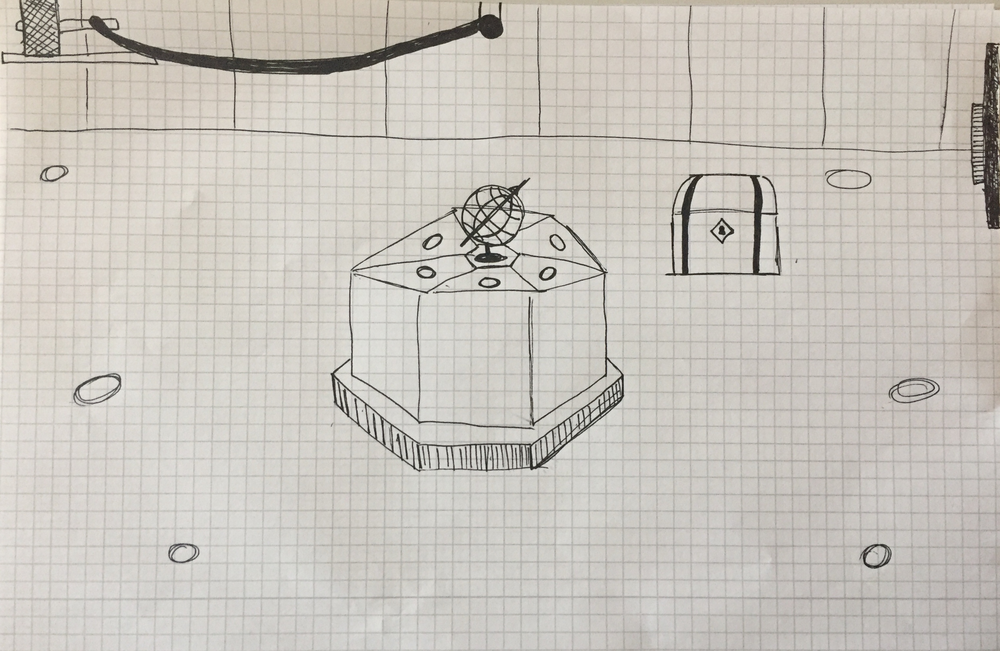

# sevignani_inktober

Großer Raum, in der Mitte befindet sich ein Altar artiges Podest, in deren Mitte der Globus steht. Auf dem Altar sind Gussformen von Ringen. Die Ringe sind im Raum verteilt und müssen gesammelt und dann in die richtige Form eingesetzt werden. Nachdem man alle Ringe eingesetzt hat beginnt der Globus sich zu drehen und von der Decke schwingt ein Hammer, schlägt an der Wand gegen einen Button und die Schatztruhe, die davor steht öffnet sich.

